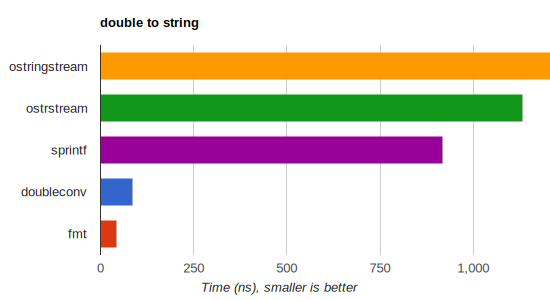

---
hide:
  - navigation
  - toc
---

# A modern formatting library

<h2>Safety</h2>

  Inspired by Python's formatting facility, {fmt} provides a safe replacement
  for the <code>printf</code> family of functions. Errors in format strings,
  which are a common source of vulnerabilities in C, are <b>reported at
  compile time</b>. For example:

  <pre><code class="language-cpp"
  >fmt::format("{:d}", "I am not a number");</code></pre>

  will give a compile-time error because <code>d</code> is not a valid
  format specifier for strings. APIs like <a href="api/#format">
  <code>fmt::format</code></a> <b>prevent buffer overflow errors</b> via
  automatic memory management.

<a href="api#compile-time-checks">→ Learn more</a>

<h2>Extensibility</h2>

  Formatting of most <b>standard types</b>, including all containers, dates,
  and times is <b>supported out-of-the-box</b>. For example:
  
  <pre><code class="language-cpp"
  >fmt::print("{}", std::vector{1, 2, 3});</code></pre>

  prints the vector in a JSON-like format:

  <pre><code>[1, 2, 3]</code></pre>

  You can <b>make your own types formattable</b> and even make compile-time
  checks work for them.

<a href="api#udt">→ Learn more</a>

<h2>Performance</h2>

  {fmt} can be anywhere from <b>tens of percent to 20-30 times faster</b> than
  iostreams and <code>sprintf</code>, especially for numeric formatting.

  The library <b>minimizes dynamic memory allocations</b> and can optionally
  <a href="api#compile-api">compile format strings</a> to optimal code.

<h2>Unicode support</h2>

  {fmt} provides <b>portable Unicode support</b> on major operating systems
  with UTF-8 and <code>char</code> strings. For example:

  <pre><code class="language-cpp"
  >fmt::print("Слава Україні!");</code></pre>

  will be printed correctly on Linux, macOS, and even Windows console,
  irrespective of the codepages.

  The default is <b>locale-independent</b>, but you can opt into localized
  formatting and {fmt} makes it work with Unicode, addressing issues in the
  standard libary.

<h2>Fast compilation</h2>

  The library makes extensive use of <b>type erasure</b> to achieve fast
  compilation. <code>fmt/base.h</code> provides a subset of the API with
  <b>minimal include dependencies</b> and enough functionality to replace
  all uses of <code>*printf</code>.

  Code using {fmt} is usually several times faster to compile than the
  equivalent iostreams code, and while <code>printf</code> compiles faster
  still, the gap is narrowing.

<a href=
"https://github.com/fmtlib/fmt?tab=readme-ov-file#compile-time-and-code-bloat">
→ Learn more</a>

<h2>Small binary footprint</h2>

  Type erasure is also used to prevent template bloat, resulting in <b>compact
  per-call binary code</b>. For example, a call to <code>fmt::print</code> with
  a single argument is just <a href="https://godbolt.org/g/TZU4KF">a few
  instructions</a>, comparable to <code>printf</code> despite adding
  runtime safety, and much smaller than the equivalent iostreams code.

  The library itself has small binary footprint and some components such as
  floating-point formatting can be disabled to make it even smaller for
  resource-constrained devices.

<h2>Portability</h2>

  {fmt} has a <b>small self-contained codebase</b> with the core consisting of
  just three headers and no external dependencies.

  The library is highly portable and requires only a minimal <b>subset of
  C++11</b> features which are available in GCC 4.9, Clang 3.4, MSVC 19.10
  (2017) and later. Newer compiler and standard library features are used
  if available, and enable additional functionality.

  Where possible, the output of formatting functions is <b>consistent across
  platforms</b>.

<h2>Open source</h2>

  {fmt} is in the top hundred open-source C++ libraries on GitHub and has
  <a href="https://github.com/fmtlib/fmt/graphs/contributors">hundreds of
  all-time contributors</a>.

  The library is distributed under a permissive MIT
  <a href="https://github.com/fmtlib/fmt#license">license</a> and is
  <b>relied upon by many open-source projects</b>, including Blender, PyTorch,
  Apple's FoundationDB, Windows Terminal, MongoDB, and others.

